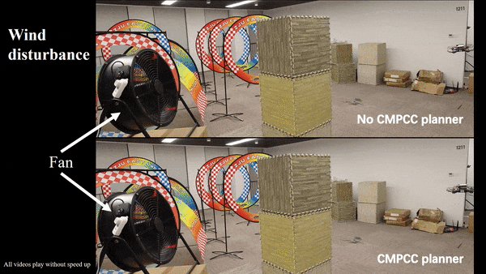

# CMPCC
Corridor-based Model Predictive Contouring Control for Aggressive Drone Flight

## Overview
CMPCC is an efficient, receding horizon, local adaptive low level planner as the middle layer between our original planner and controller. It contains following features: 
-  online flight speed optimization
-  strict safety and feasibility
-  real-time performance




Complete video: [cmpcc-video](https://www.youtube.com/watch?v=_7CzBh-0wQ0)

paper summited: [cmpcc-paper](https://arxiv.org/abs/2007.03271) 

### File Structure
Key modules are contained in the ros package **src/cmpcc**. A lightweight simulator is contained in **src/simualtion** and some functional codes and plugins are in **src/utils**. 

## Prerequisites
- Our software is developed and tested in Ubuntu 18.04, ROS Melodic. Other version may require minor modification. 
- We use [OSQP](https://github.com/oxfordcontrol/osqp) to solve the qp problem.
- The cmpcc package depends on [yaml-cpp](https://github.com/jbeder/yaml-cpp) to read parameters of map and corridor.
- The simulator depends on the C++ linear algebra library Armadillo, which can be installed by sudo apt-get install libarmadillo-dev.

## Build on ROS
After the prerequisites are satisfied, you can clone this repository, which is already a ros-workspace:
```
git clone https://github.com/ZJU-FAST-Lab/CMPCC.git
cd CMPCC
catkin_make
``` 

## Run the Simulation
```
source devel/setup.bash
./simulation.sh
```

